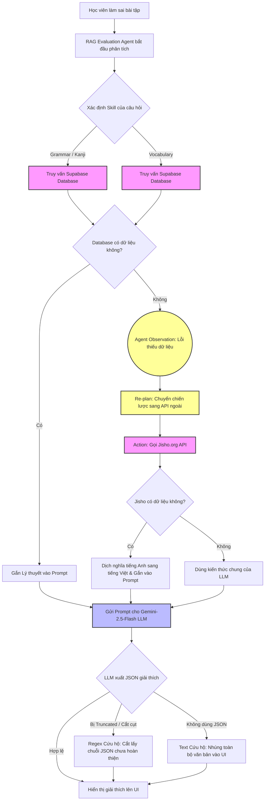

# Sơ đồ Kiến trúc Hệ thống - Nihongo Mentor AI

Sơ đồ dưới đây mô tả luồng hoạt động của Hệ thống Autonomous AI Agent trong ứng dụng Nihongo Mentor, bao gồm khả năng Tự chủ (Autonomy) và gọi Công cụ (Tool Use).

## Chú thích:
- **Công cụ (Tools):** Các khối hình màu hồng đại diện cho các công cụ mà Agent sử dụng tương tác với thế giới bên ngoài (Database Nội bộ và API Từ điển Jisho bên ngoài).
- **Tính tự chủ (Autonomy):** Cụm khối màu vàng thể hiện vòng lặp `Observe -> Re-plan -> Act`. Agent tự phát hiện dữ liệu nội bộ bị rỗng và tự động kích hoạt API bên ngoài để bù đắp.
- **Xử lý LLM:** Khối màu xanh lam là nơi LLM (Gemini) phân tích dữ liệu và sinh câu trả lời. Hệ thống cũng có lớp phòng vệ (Regex/Text fallback) để chống lỗi JSON Truncation.
